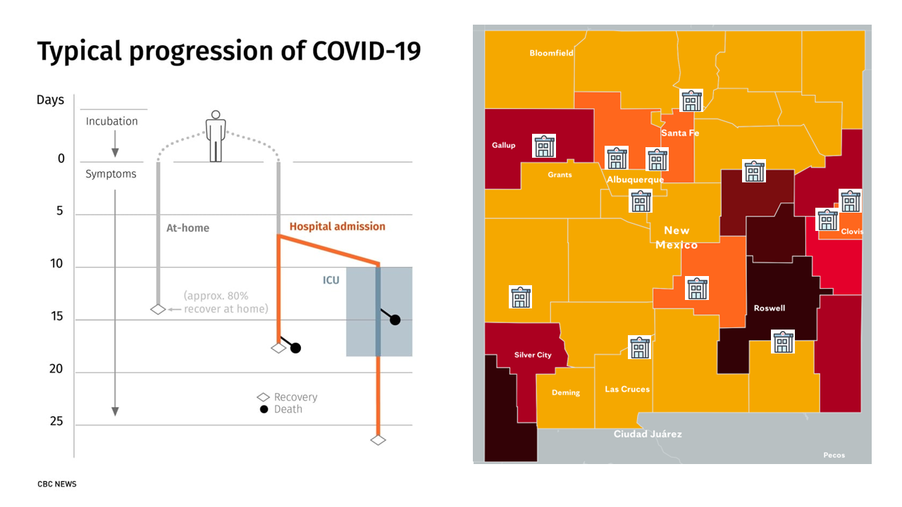
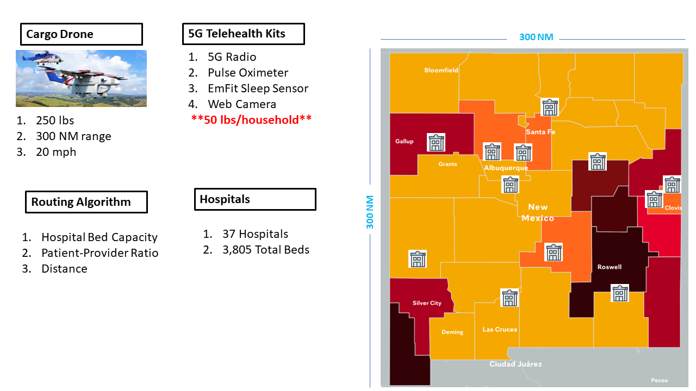
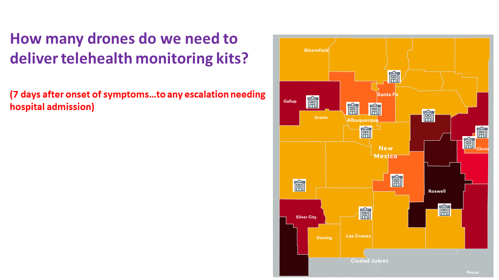
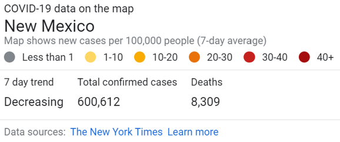

```{r setup, include=FALSE}
knitr::opts_chunk$set(echo = TRUE)
```

```{r libraries, echo=FALSE, message=FALSE}

library(data.table)
library(simmer)
library(simmer.bricks)
library(simmer.plot)

```

<br>

<hr/>

### **COVID Symptom LifeCycle and Hot Spots. Some hospitals at capacity for beds. New Mexico one of the worst states for available hospital beds.**

<br>



<br>

<hr />

### **Proposed Solution to Mitigate Need for Beds and Free Up Hospital Resources**

<br>



<br>

The average cost for a COVID-19 hospitalization varies by state.


Costs are defined as "Complex" - requiring ICU or ventilator or as "Noncomplex" - not requiring ICU or ventilator.

For New Mexico these costs are:
- Complex: $272,593
- Noncomplex: $98,336


<hr />

### **How Many Do We Need To Make This Work?**

<br>



<br>

### **Simulation PLUS Some Optimization..**

<hr/>

<br>

<br>

```{r simulation-parameters}

# ***  Parameters Required For Simulation ***
set.seed(3141)

# Simulation Duration
SimTime = 480*30


```

<br>



<br>

```{r patient-arrivals}

# Patient  Arrivals/Infection Rate 
Arrivals = function() {return(rpois(1,5))} # TBD - Placeholder for now..will link to CDC metrics

# Patient Routing to Appropriate Hospital based on Hospital Bed Capacity, Patient-Provider Ratio, and Distance
ICU_Routing = function() {return(sample.int(2,1, replace = T, c(.8,.2)))} # TBD - Placeholder until above algorithm implemented

```


```{r drone-processing-kit-distribution}

# Processing Times
PA = function() {return(runif(1,10,15))}  # Placeholder - TBD based on IVR_Route algorithm
PB = function() {return(runif(1,15,20))}  # Placeholder - TBD based on IVR_Route algorithm
PC = function() {return(runif(1,20,30))}  # Placeholder - TBD based on IVR_Route algorithm
PD = function() {return(runif(1,10,20))}  # Placeholder - TBD based on IVR_Route algorithm
PE = function() {return(runif(1,10,20))}  # Placeholder - TBD based on IVR_Route algorithm
SS = function() {return(runif(1,5,8))}  # Placeholder - TBD based on IVR_Route algorithm


```

```{r resources}

# Department Definitions
Drones = c("Drone1" , "Drone2", "Drone3",
         "Drone4", "Drone5" , "Drone6", "Drone7", "Drone8", "Drone9", "Drone10")
HospitalA = Drones[c(2)]
HospitalB = Drones[c(3,10)]
HospitalC = Drones[c(1,4,5)]
HospitalD = Drones[c(6,4)]
HospitalE = Drones[c(7,8,9)]

HospitalA; HospitalB; HospitalC; HospitalD; HospitalE


# Resource Selection Policy
# Options Include
#     "shortest-queue", "shortest-queue-available"
#     "round-robin", "round-robin-available"
#     "random", "random-available", "first-available"

Policy = "first-available"

```


```{r simulation-environment}

# Create Simulation Environment
env <- simmer()

# Sub Trajectories for Routes

t_HospA <- trajectory() %>% 
  timeout(0.75*1) %>%   # IVR time
  select(HospitalA, Policy) %>% 
  seize_selected(1) %>% 
  timeout(PA) %>% 
  release_selected(1) 
  
  
t_HospB <- trajectory() %>%
  timeout(0.75*1) %>%  # IVR time
  select(HospitalB, Policy) %>%
  seize_selected(1) %>%
  timeout(PB) %>%
  release_selected(1)

t_HospC <- trajectory() %>% 
  timeout(0.75*2) %>%
  select(HospitalC, Policy) %>%
  seize_selected(1) %>%
  timeout(PC) %>%
  release_selected(1)

t_HospD <- trajectory() %>% 
  timeout(0.75*3) %>%
  select(HospitalD, Policy) %>%
  seize_selected(1) %>%
  timeout(PD) %>%
  release_selected(1)

t_HospE <- trajectory() %>% 
  timeout(0.75*3) %>%
  select(HospitalE, Policy) %>%
  seize_selected(1) %>%
  timeout(PD) %>%
  release_selected(1)


```


```{r plot-trajectories}

# Print & Plot Trajectory
print(t_HospA)

plot(t_HospA)


```


```{r trajectory-calls}

# Trajectory - Calls
t_Calls <- trajectory() %>%
  set_attribute("Route",IVR_Route) %>%
  branch(function() get_attribute(env,"Route"),
         continue = rep(FALSE,6),
         t_HospA,          # Route 1          
         t_HospB,          # Route 2 
         t_HospC,          # Route 3 
         t_HospD,          # Route 4
         t_HospE,          # Route 5
         trajectory() %>%   # Route 6
           timeout(0.75*6)  %>%
           timeout(SS)
  ) 

# Create Resources (Drones)
for(i in Drones) {
  env %>% add_resource(i,1)
}


# Add Arrivals - mon = 2 is to log attributes data
env %>% add_generator("Call ", t_Calls, Arrivals, mon = 2)


```


```{r run-simulation-store-results}

# Run Simulation
env %>% run(until = SimTime)

# Store Results
arr = get_mon_arrivals(env)
res = get_mon_resources(env)
att = get_mon_attributes(env)

head(arr)
tail(arr)
res[1:10,]
nrow(arr)

att[1:10,]

results = as.data.table(merge(arr,att))
results = results[order(start_time)]
results[, c("replication","finished","time","key") := NULL]
results[, flow_time := end_time - start_time]

results
nrow(results)
results[flow_time > 45]


```

```{r helper-function}

# Input = Environment
# Output - Number of Arrivals Complete, Throughput, PCE, Histogram of Process Time, Flow Time
SimSummary <- function(env, k = 1) {
  x = data.table(get_mon_arrivals(env))
  x = x[finished == TRUE]
  x = x[, nname := gsub("[0-9]","",name)]
  anames = unique(x$nname)
  
  for(i in anames) {
    y = x[nname == i]
    N = nrow(y)
    TH = k*N/max(y$end_time)
    FT = mean(y$end_time - y$start_time)
    PCE = sum(y$activity_time)/sum(y$end_time - y$start_time)
    cat("\n",
        paste("Number of",paste(i,"'s Processed :",sep = ""), N), "\n",
        paste("Avg. Throughput              :", round(TH,2)), "\n",
        paste("Avg. Flow Time               :", round(FT,2)), "\n",
        paste("Avg. Work In Progress        :", round(TH*FT/k,2)), "\n",
        paste("Process Cycle Efficiency     :", round(PCE,2)), "\n")
  }
}


```


```{r metrics}

arr[1:15,]
results[activity_time > 30]

# Plot Flow Times
plot(arr, metric = "flow_time")

# Box Plot of Flow Time By Call Route
boxplot(flow_time ~ value, data = results)

sub = results[value == 2]
ggplot(sub, aes(start_time, flow_time)) + geom_point() + geom_smooth(method = "lm")


# Plot Resource Utilization
plot(res, metric = "utilization")

# Plot Resource Usage
plot(res, metric = "usage")
plot(res, metric = "usage", HospitalA)
plot(res, metric = "usage", HospitalC)

# Summary Stats
SimSummary(env)
SimSummary(env,480)


```


