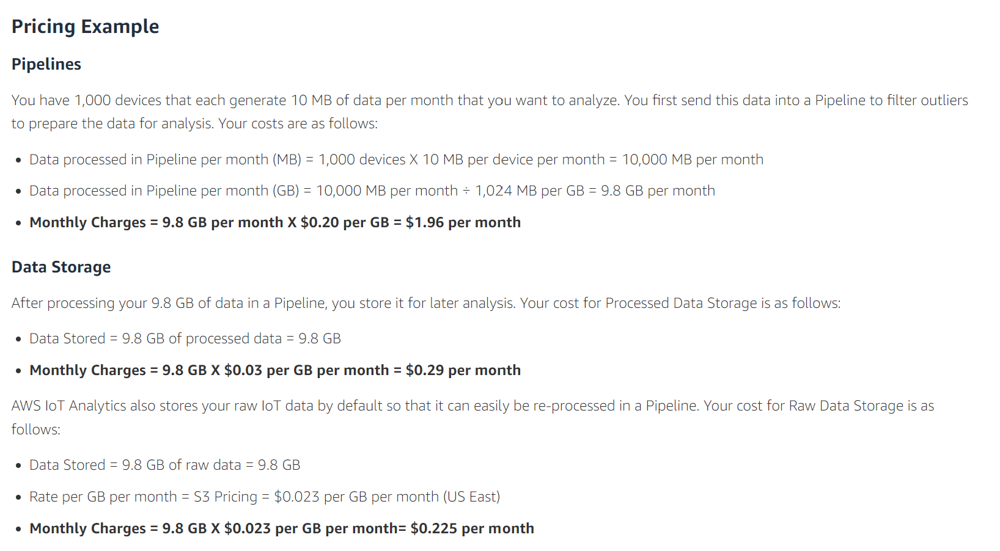

```{r setup, include=FALSE}

knitr::opts_chunk$set(cache = TRUE, warning=FALSE, message=FALSE, eval = FALSE, echo = TRUE)

```

### Source Data

[New Mexico COVID Map](https://www.mayoclinic.org/coronavirus-covid-19/map/new-mexico)


[New Mexico COVID Dashboards](https://covid19.healthdata.org/united-states-of-america/new-mexico?view=cumulative-deaths&tab=trend)


[New Mexico State Data](https://cvprovider.nmhealth.org/public-dashboard.html)

<br>


### Simulation Data

[Hospitalizations](https://us-east-1.quicksight.aws.amazon.com/sn/accounts/689967901690/dashboards/c491958c-b7bd-4af6-b1d5-0e4c9654ce07?directory_alias=cana-awp-test)


[Hospital Capacity](https://us-east-1.quicksight.aws.amazon.com/sn/accounts/689967901690/dashboards/fcbff790-1b2d-40ab-902c-ddfd9d51425c?directory_alias=cana-awp-test)


[Patient Attributes](https://us-east-1.quicksight.aws.amazon.com/sn/accounts/689967901690/dashboards/a69e4a22-44f9-4f39-9961-fd9fa00a9f88?directory_alias=cana-awp-test)

<br>


```{r load-libraries}

library(rvest)
library(xml2)
library(dplyr)
library(magrittr)
library(tidyverse)
library(readr)
library(here)
library(data.table)
library(lubridate)
library(httr)
library(jsonlite)
library(arrow)
library(aws.s3)
library(aws.signature)
library(kableExtra)
library(sf)
library(s2)
library(fuzzyjoin)


```

<br>

### Initial Test File

```{r test-file}

bernalillo_ts <- read_csv(here("data","hospitalizations","bernalillo_ts.csv"), skip = 2)

```

<br>

### New Mexico County Level Hospitalization Data


```{r new-mexico-hospitalization-data}

setwd(here("data","hospitalizations"))

nm_county_data <- list.files(path = here("data","hospitalizations"), pattern = "*.csv") %>% 
  map_df(~fread(.,skip=2, header=T))

nm_county_data

```

<br>

### New Mexico Population Level COVID Data


```{r county-population-data}

us_covid_data <- read_csv(here("data","United_States_COVID-19_Community_Levels_by_County.csv"))


nm_covid_data <- us_covid_data %>% 
  filter(state == "New Mexico") %>% 
  mutate(Date_Updated = mdy(date_updated)) %>% 
  select(!date_updated) %>% 
  filter(Date_Updated == max(Date_Updated))


```

<br>

### New Mexico Weekly County COVID Hospitalizations


```{r weekly-county-hospitalizations}

nm_county_patient_flows <- nm_county_data %>% 
  left_join(.,
            nm_covid_data,
            by=c("FIPS code"="county_fips")) %>% 
  mutate(Hospitalizations_per_Week = round(.[[9]] * (.[[19]]/100000),0)) 

```

<br>

### Web Scrape New Mexico Daily COVID Cases


```{r daily-covid-cases}

url <- "https://covid19.healthdata.org/api/data/hospitalization?location=554&measure%5B%5D=21&scenario%5B%5D=1&scenario%5B%5D=3&scenario%5B%5D=13&date="


cases_response <- GET(url)
cases_json <- content(cases_response, as = "text")
cases_list <- fromJSON(cases_json, flatten = TRUE) 
cases_df <- cases_list$values %>% 
  as_tibble()

names(cases_df) <- cases_list$keys

cases_df %<>% 
  mutate(mean = as.numeric(mean))


```

<br>

### Web Scrape New Mexico Daily COVID ICU Hospitalizations


```{r daily-covid-icu-beds}

url <- "https://covid19.healthdata.org/api/data/hospitalization?location=554&measure%5B%5D=2&scenario%5B%5D=1&date="


icu_beds_response <- GET(url)
icu_beds_json <- content(icu_beds_response, as = "text")
icu_beds_list <- fromJSON(icu_beds_json, flatten = TRUE) 
icu_beds_df <- icu_beds_list$values %>% 
  as_tibble()

names(icu_beds_df) <- icu_beds_list$keys

icu_beds_df %<>% 
  mutate(mean = as.numeric(mean))


```

<br>

### Web Scrape New Mexico Daily COVID Hospitalizations


```{r daily-covid-beds}

url <- "https://covid19.healthdata.org/api/data/hospitalization?location=554&measure%5B%5D=1&scenario%5B%5D=1&date="


covid_beds_response <- GET(url)
covid_beds_json <- content(covid_beds_response, as = "text")
covid_beds_list <- fromJSON(covid_beds_json, flatten = TRUE) 
covid_beds_df <- covid_beds_list$values %>% 
  as_tibble()

names(covid_beds_df) <- covid_beds_list$keys

covid_beds_df %<>% 
  mutate(mean = as.numeric(mean))


```

<br>

The average cost for a COVID-19 hospitalization varies by state.


Costs are defined as "Complex" - requiring ICU or ventilator or as "Noncomplex" - not requiring ICU or ventilator.

For New Mexico these costs are:
- Complex: $272,593
- Noncomplex: $98,336

For Telehealth:

5G for (100) people without any network service -
100 SIM cards, Private 5G Network Plus AWS Snowball for 60 Days:
11,250 *2 + 14,400 = 36,900

(no at home monitoring via provided internet)
AWS 5G/IoT Analytics: 3,690.00 per person 
emfit QS sensor: 250.00
cosinuss° Two: 300.00

(at home monitoring via user provided internet)
emfit QS sensor: 250.00
[](https://emfit.com/)


cosinuss° Two: 300.00
[](https://www.cosinuss.com/en/portfolio-items/study-on-remote-patient-monitoring-for-covid-19/)


<br>

<hr>

AWS IoT analytics: 50.00/month
[](https://aws.amazon.com/iot-analytics/pricing/)


<br>

<hr>


[](https://www.freightwaves.com/news/elroy-air-to-deliver-100-cargo-drones-to-bristow-group)


<br>


Overhead:
Lease/Rent: Elroy Air's pre-production Chaparral vehicle: the first end-to-end autonomous vertical take-off and landing (VTOL) aerial cargo system, designed for aerial transport of 300-500 lbs of goods over a 300 mile range


Estimate 50K per month for 1 A/C
1 A/C can make 30 deliveries depending on range/proximity of patients


---

<br>

### **Business Question - How many drone A/C are needed and what is break even point for cost savings?**

<br>

---


```{r simulation-dataset}

simulation_ds <- cases_df %>% 
  select(1,4) %>% 
  mutate(covid_hospitalization = round(mean,0)) %>% 
  select(!mean) %>% 
  left_join(.,
            icu_beds_df,
            by="date_reported") %>% 
  mutate(icu_hospitalization = round(mean,0)) %>% 
  select(1,2,10) %>% 
  left_join(.,
            cases_df,
            by="date_reported") %>% 
  mutate(covid_cases = round(mean,0)) %>% 
  select(1,11,2,3) %>% 
  mutate(date_reported = ymd_hms(date_reported),
         potential_telehealth = covid_hospitalization - icu_hospitalization,
         inpatient_cost = potential_telehealth * 98336,
         telehealth_kit_cost = potential_telehealth * 600,
         required_flights = round(potential_telehealth / 30,0)) 


```

<br>

### Web Scrape Hospital Bed Capacity


```{r new-mexico-hospital-beds, eval=FALSE}

url <- "https://www.ahd.com/states/hospital_NM.html"

nm_hospital_beds <- read_html(url) %>%
  html_nodes(xpath='//*[@id="main"]/div[2]/div/table') %>%
  html_table()

nm_beds <- nm_hospital_beds[[1]]

nm_hospital_beds <- nm_beds %>% 
  mutate(StaffedBeds = as.numeric(StaffedBeds)) %>% 
  filter(!is.na(StaffedBeds))


total_nm_hospital_beds <- sum(nm_hospital_beds$StaffedBeds, na.rm = TRUE)
total_nm_hospital_beds

```


```{r geocode-hospital-input}

nm_hospitals <- nm_beds[1:36,1:2] %>% 
  mutate(State = "New Mexico") %>% 
  mutate(Name = `Hospital Name`) %>% 
  unite('Address', 1:3, sep = " ") %>% 
  arrange(Name) %>% 
  dplyr::select(Name,Address)

write_csv(nm_hospitals, here("data","geocode","input","hospitals.csv"))

```

<br> 

### Uploaad to geocodio


<br>

### UAV Flight Plan Simulation from Geocoded Data


```{r geospatial-datasets}


# NM hospitals
hospitals <- read_csv(here("data","hospitals","hospitals.csv"),col_types=cols(...1=col_skip()))


# Geocoded NM Zipcodes + 4 
zip_plus4_geocodio <- read_csv(here("data","geocode","output","zip_plus4_geocodio.csv"))


# Geocoded NM hospitals
hospitals_geocodio <- read_csv(here("data","geocode","output","hospitals_geocodio.csv"))


# New Mexico Census Shapefile
nm_tract_sf <- read_sf(here("data","shapefiles","tl_2019_35_tract.shp"))


# EPA Smart City dataset
EPA_db <- s3read_using(FUN=read.csv, object="s3://irad-2201-scenario-modeling/simulation/zip_codes/EPA_SmartLocationDatabase_V3_Jan_2021_Final.csv",sep = ",",stringsAsFactors = F, header=T)


```


<br>


### Hospital Bed Capacities


```{r hospital-resources, eval=FALSE}

hospitals <- hospitals_geocodio %>% 
  select(1,14,13,11,3,4) %>% 
  left_join(.,
            nm_beds,
            by=c("Name"="Hospital Name")) %>% 
  select(1:4,5,6,8) %>% 
  mutate(Zip = as.character(Zip)) %>% 
  rename(City = City.x, h_latitude = Latitude, h_longitude = Longitude) %>% 
  mutate(H_Code = as.numeric(rownames(hospitals_geocodio)))

```

<br>

### Patient Attributes: Add Zip+4 and Assign Patient to Hospital. We will sample this dataset and create flight plans for our drone flight simulation.

<br>


```{r closest-hospital}


library(s2)

zip_plus4_geocodio %<>% 
  filter(State == 'NM') %>% 
  select(-c(8:11))


set1 <- zip_plus4_geocodio[,c(1,4,5)]

set2 <- hospitals_geocodio[,c(1,3,4)]


set1_s2 <- s2_lnglat(set1$Longitude, set1$Latitude)

set2_s2 <- s2_lnglat(set2$Longitude, set2$Latitude)

set1$Closest_Hospital <- s2_closest_feature(set1_s2, set2_s2)


set1


```


```{r patient-location-attributes}


patient_attributes <- zip_plus4_geocodio %>% 
  mutate(Zip = str_extract(`Zip+4`, "\\d{5}")) %>% 
  left_join(.,
            set1,
            by=c("Zip+4", "Latitude", "Longitude")) %>% 
  left_join(.,
            hospitals,
            by=c("Closest_Hospital"="H_Code")) %>% 
  select(-c(6,7,12,13)) %>% 
  mutate(StaffedBeds = as.numeric(StaffedBeds)) %>% 
  unique()
  


```


<br>


```{r view-nm-shapefile}

plot(nm_tract_sf[4])

```


```{r nm-shapefile-geoid}


nm_tract_sf_join <- nm_tract_sf %>% 
  mutate(nm_id = as.numeric(rownames(nm_tract_sf)))


set3 <- nm_tract_sf_join[,c(14,4,11,12)]


set3_s2 <- s2_lnglat(set3$INTPTLON, set3$INTPTLAT)


set1$Closest_GEOID <- s2_closest_feature(set1_s2, set3_s2)


set1


```


```{r patient-location-geoid}


attributes <- patient_attributes %>% 
  left_join(.,
            set1,
            by=c("Zip+4", "Latitude", "Longitude")) %>% 
  unique()


geoid__attributes <- attributes %>% 
  left_join(.,
           set3,
           by=c("Closest_GEOID"="nm_id")) %>% 
  unique()


```


```{r smart-city-epa-data}

geoid_table <- geoid__attributes %>% 
  select(1,4,5,20,21,22) %>% 
  mutate(geo_lat = as.numeric(INTPTLAT),
         geo_long =as.numeric(INTPTLON)) %>% 
  select(-5,-6)


# 2+3+6+1=12

nm_epa_db <- EPA_db %>% 
  filter(STATEFP == 35) %>% 
  mutate(geoid1 = formatC(.[[5]], width=3, flag="0")) %>% 
  mutate(geoid2 = formatC(.[[6]], width=6, flag="0")) %>% 
  mutate(geoid3 = formatC(.[[7]], width=1, flag="0")) %>%
  mutate(geoid = paste0(.[[4]], geoid1, geoid2, geoid3)) %>% 
  select(121,111:115)


```


<br>


### View Simulation Source Time Series


```{r view-hospitalization-timeseries, eval=TRUE}

simulation_ds %>% 
  head(50) %>% 
  kbl() %>% 
  kable_paper("striped", full_width=F, font_size=10) 


```


<br>


### View Hospital Resources

```{r view-hospital-capacity, eval=TRUE}

hospitals %>% 
  head(20) %>% 
  kbl() %>% 
  kable_paper("striped", full_width=F, font_size=10) 

```


<br>


### View Patient Attributes

```{r view-patient-attributes, eval=TRUE}

patient_attributes %>% 
  head(15) %>% 
  kbl() %>% 
  kable_paper("striped", full_width=F, font_size=10) 


```


<br>


### View EPA Smart City Data

```{r view-patient-attributes, eval=TRUE}

nm_epa_db %>% 
  head(15) %>% 
  kbl() %>% 
  kable_paper("striped", full_width=F, font_size=10) 


```


---


### Save to AWS S3

<br>

```{r write-csv-s3-local-mode, eval=FALSE}


s3write_using(simulation_ds, FUN = write.csv,
                    bucket = "irad-2201-scenario-modeling",
                    object = "simulation/hospitalizations/hospitalizations.csv")


s3write_using(hospitals, FUN = write.csv,
                    bucket = "irad-2201-scenario-modeling",
                    object = "simulation/hospitals/hospitals.csv")


s3write_using(patient_attributes, FUN = write.csv,
                    bucket = "irad-2201-scenario-modeling",
                    object = "simulation/patient-attributes/patient_attributes.csv")


s3write_using(nm_epa_db, FUN = write.csv,
                    bucket = "irad-2201-scenario-modeling",
                    object = "s3://irad-2201-scenario-modeling/simulation/epa/epa.csv")


s3write_using(geoid__attributes, FUN = write.csv,
                    bucket = "irad-2201-scenario-modeling",
                    object = "s3://irad-2201-scenario-modeling/simulation/geospatial/geospatial.csv")


```


<br>

---

### Save to AWS S3 as parquet for AWS Athena queries/visualization with AWS QuikSight

<br>

#### Apache Spark Local Mode

```{r spark-session, eval=FALSE}

library(sparklyr)

```


```{r spark-install-local-mode, eval=FALSE}

spark_install(version = "3.2", hadoop_version = "3.2")

```

<br>

```{r start-spark-session, eval=FALSE}

# Configure Cluster / Start Session
conf <- spark_config()
conf$sparklyr.defaultPackages <- "org.apache.hadoop:hadoop-aws:3.3.2"

sc <- spark_connect(master = "local", version = "3.2")

```

<br>

```{r convert-to-spark-df, eval=FALSE}

sdf1 <- copy_to( 
  sc, 
  simulation_ds, 
  name = spark_table_name(substitute(simulation_ds)), 
  overwrite = TRUE, 
  memory = TRUE, 
  repartition = 0L
) 


sdf2 <- copy_to( 
  sc, 
  hospitals, 
  name = spark_table_name(substitute(hospitals)), 
  overwrite = FALSE, 
  memory = TRUE, 
  repartition = 0L
) 


sdf3 <- copy_to( 
  sc, 
  patient_attributes, 
  name = spark_table_name(substitute(patient_attributes)), 
  overwrite = FALSE, 
  memory = TRUE, 
  repartition = 0L
) 


```

<br>

```{r write-csv-files-to-s3-data-lake, eval=FALSE}

spark_write_csv(sdf1, path = 's3a://irad-2201-scenario-modeling/simulation/hospitalizations/', mode = "overwrite", skipNul = TRUE)

spark_write_csv(sdf2, path = 's3a://irad-2201-scenario-modeling/simulation/hospitals/', mode = "overwrite", skipNul = TRUE)

spark_write_csv(sdf3, path = 's3a://irad-2201-scenario-modeling/simulation/patient-attributes/', mode = "overwrite", skipNul = TRUE)


```

<br>

```{r write-parquet-files-to-s3-data-lake, eval=FALSE}

spark_write_parquet(sdf1, path = 's3a://irad-2201-scenario-modeling/parquet/hospitalizations/', mode = "overwrite", skipNul = TRUE)

spark_write_parquet(sdf2, path = 's3a://irad-2201-scenario-modeling/parquet/hospitals/', mode = "overwrite", skipNul = TRUE)

spark_write_parquet(sdf3, path = 's3a://irad-2201-scenario-modeling/parquet/patient-attributes/', mode = "overwrite", skipNul = TRUE)


```

<br>

```{r render-markdown, include=FALSE}

rmarkdown::render("nm_covid_data.Rmd")

```